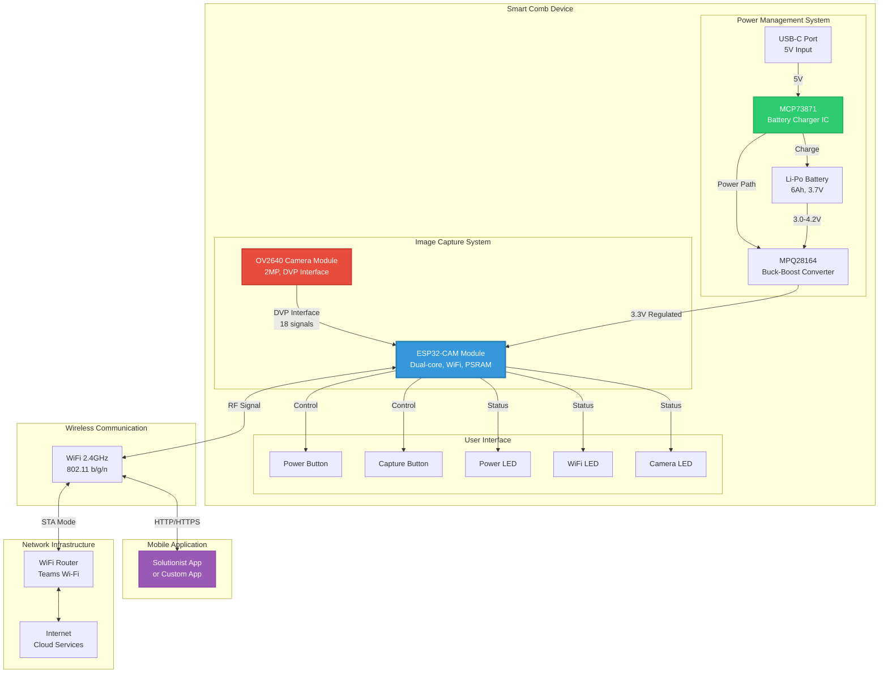
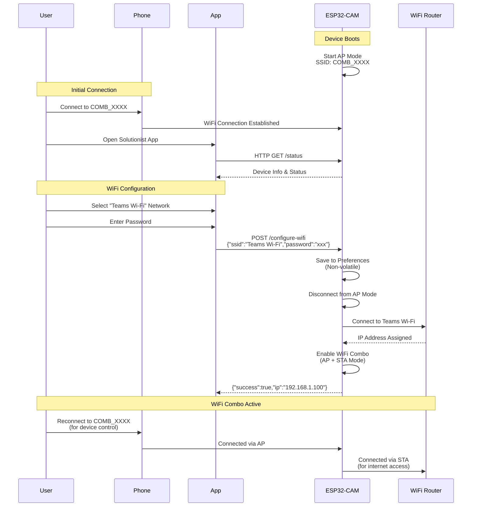
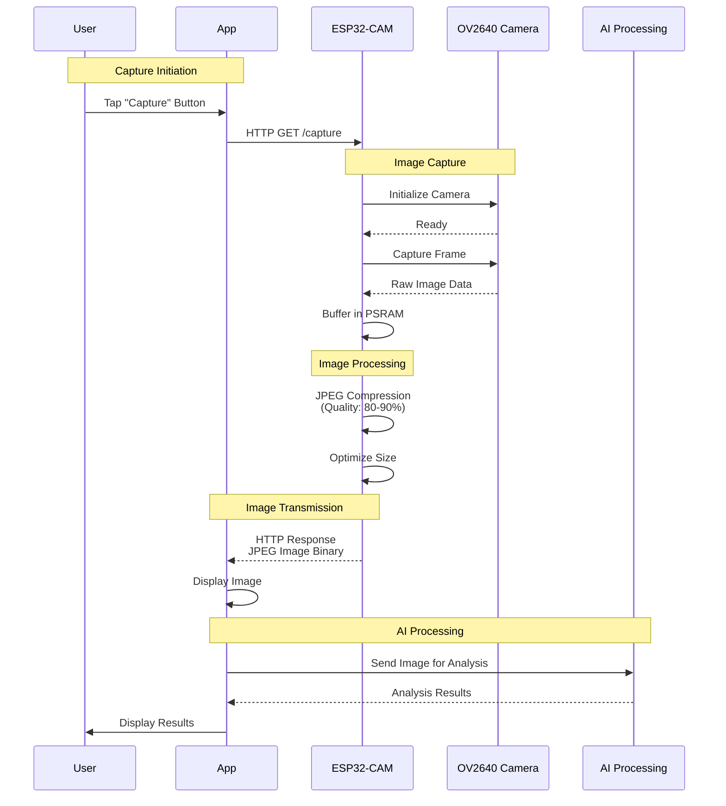
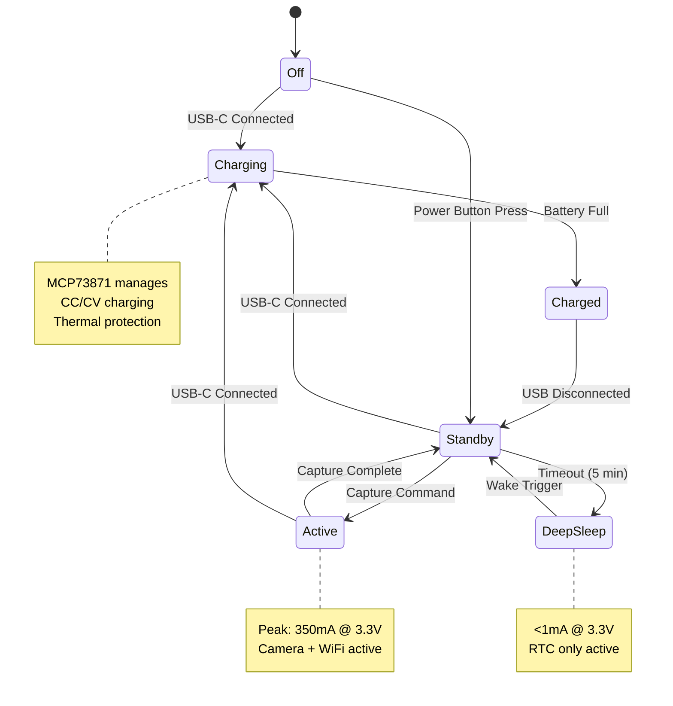
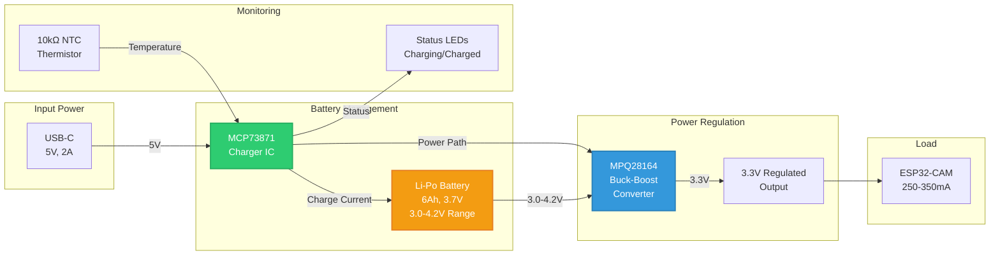
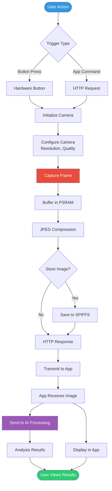
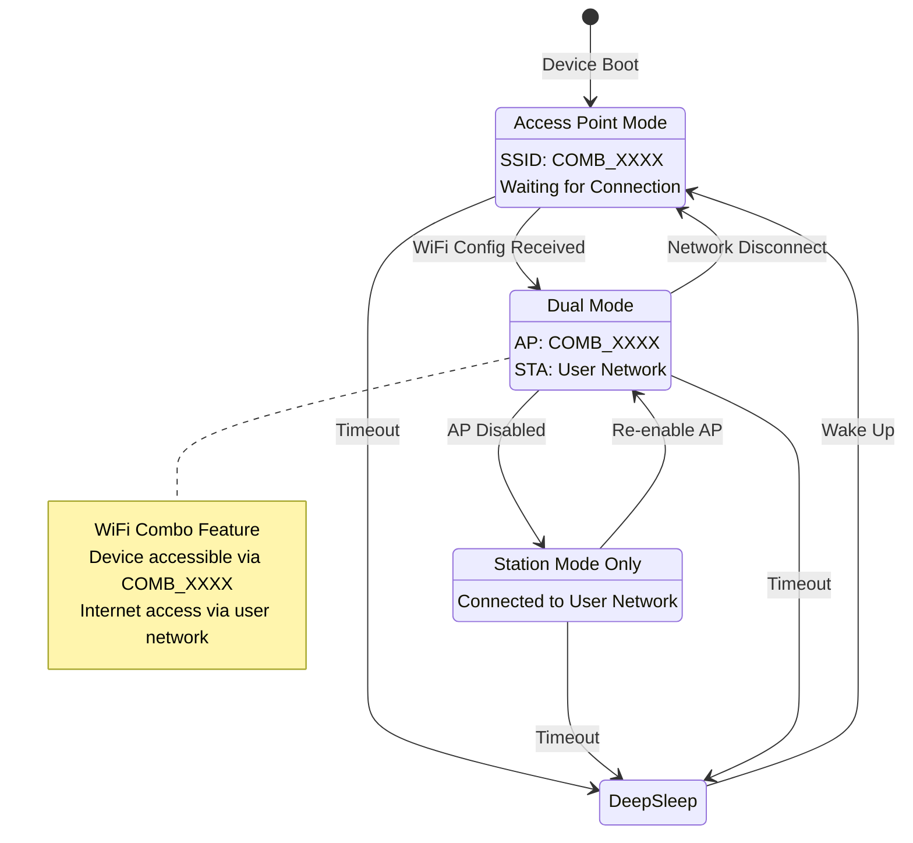
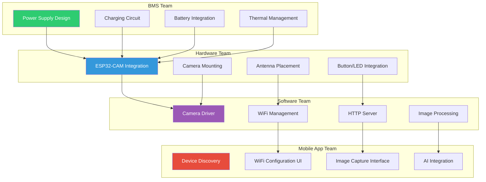

# Smart Comb System - Visual Diagrams

## Complete System Architecture

## WiFi Configuration Flow

## Image Capture & Transmission Flow

## Power Management Flow

## BMS Integration Architecture

## Component Interconnection Diagram

```mermaid
graph TB
    subgraph "ESP32-CAM Module"
        ESP[ESP32-CAM<br/>Main Processor]
        PSRAM[4MB PSRAM<br/>Image Buffer]
        FLASH[4MB Flash<br/>Optional Storage]
    end
    
    subgraph "Camera Interface"
        OV[OV2640 Camera<br/>18-pin DVP]
        XCLK[GPIO 4: XCLK]
        SIOD[GPIO 5: SIOD]
        SIOC[GPIO 18: SIOC]
        VSYNC[GPIO 19: VSYNC]
        HREF[GPIO 21: HREF]
        PCLK[GPIO 22: PCLK]
        DATA[GPIO 23,25,26,27<br/>32,35,34,39: Y2-Y9]
        PWDN[GPIO 36: PWDN]
        RST[GPIO 2: RESET]
    end
    
    subgraph "Power Supply"
        VCC[3.3V from BMS]
        GND[Ground]
    end
    
    subgraph "WiFi Antenna"
        ANT[2.4GHz Antenna<br/>50Ω]
    end
    
    subgraph "User Interface"
        PWR_BTN[Power Button]
        CAP_BTN[Capture Button]
        PWR_LED[Power LED]
        WIFI_LED[WiFi LED]
        CAM_LED[Camera LED]
    end
    
    ESP --> PSRAM
    ESP --> FLASH
    ESP --> OV
    
    XCLK --> OV
    SIOD --> OV
    SIOC --> OV
    VSYNC --> OV
    HREF --> OV
    PCLK --> OV
    DATA --> OV
    PWDN --> OV
    RST --> OV
    
    VCC --> ESP
    GND --> ESP
    VCC --> OV
    GND --> OV
    
    ESP --> ANT
    ESP --> PWR_BTN
    ESP --> CAP_BTN
    ESP --> PWR_LED
    ESP --> WIFI_LED
    ESP --> CAM_LED
    
    style ESP fill:#3498db,stroke:#2980b9,stroke-width:3px,color:#fff
    style OV fill:#e74c3c,stroke:#c0392b,stroke-width:2px,color:#fff
    style VCC fill:#2ecc71,stroke:#27ae60,stroke-width:2px,color:#fff
```

## Data Flow Architecture

## WiFi Mode State Machine

## Power Consumption Timeline

```mermaid
gantt
    title Power Consumption During Operation Cycle
    dateFormat X
    axisFormat %L ms
    
    section Active Capture
    Camera Init        :0, 100
    Image Capture      :100, 200
    JPEG Compression   :200, 300
    WiFi Transmission  :300, 1600
    Total Active       :0, 1900
    
    section Standby
    WiFi Connected     :1900, 300000
    Camera Off         :1900, 300000
    
    section Deep Sleep
    All Systems Off    :300000, 3600000
```

## System Integration Points

